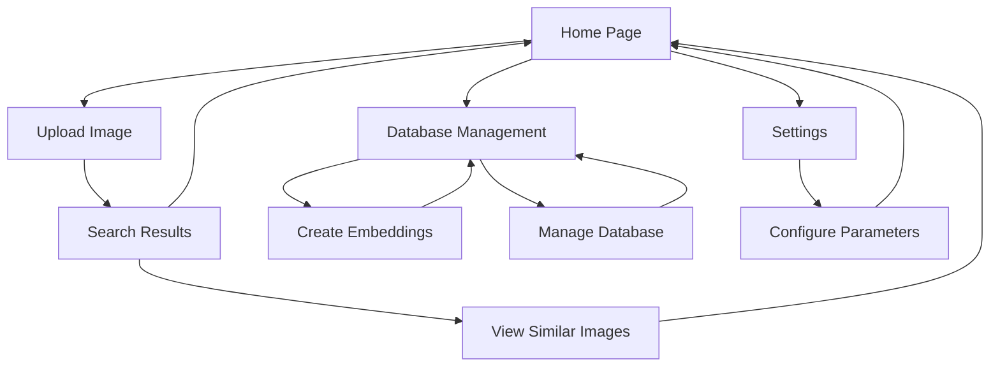

# Reverse Image Search Application - Product Requirements Document

## 1. Product Overview
A deep learning-powered reverse image search web application that allows users to find visually similar images from their local collections using advanced neural network embeddings. <mcreference link="https://github.com/tikendraw/reverse-image-search?tab=readme-ov-file" index="0">0</mcreference>

The application leverages EfficientNet-B0 for efficient image feature extraction and ChromaDB for fast vector similarity search, providing both web interface and command-line functionality for comprehensive image management and search capabilities.

Target market: Content creators, digital asset managers, photographers, and researchers who need to organize and search through large image collections efficiently.

## 2. Core Features

### 2.1 User Roles
Since this is a local/personal tool, no complex user role system is required. All users have full access to all features.

### 2.2 Feature Module
Our reverse image search application consists of the following main pages:
1. **Home Page**: Image upload interface, search functionality, similar image results display
2. **Database Management Page**: Embedding creation, directory indexing, database operations
3. **Settings Page**: Configuration options, model parameters, search preferences

### 2.3 Page Details

| Page Name | Module Name | Feature description |
|-----------|-------------|---------------------|
| Home Page | Image Upload | Upload single images via drag-and-drop or file browser, support common formats (JPG, PNG, GIF, BMP) |
| Home Page | Search Interface | Display uploaded image preview, configure number of similar results (1-20), initiate search process |
| Home Page | Results Display | Show grid of similar images with similarity scores, clickable thumbnails for full-size view, download options |
| Database Management | Directory Embedding | Select local directories, create vector embeddings for all images, progress tracking with status updates |
| Database Management | Database Operations | Update existing embeddings, delete specific directory embeddings, clear entire database, view database statistics |
| Database Management | Batch Processing | Process multiple directories simultaneously, handle large image collections efficiently |
| Settings Page | Model Configuration | Select embedding model parameters, adjust similarity thresholds, configure search algorithms |
| Settings Page | Performance Settings | Set batch processing sizes, memory usage limits, CPU/GPU preferences |

## 3. Core Process

**Main User Flow:**
1. User accesses the home page and uploads an image for search
2. System processes the image and generates vector embeddings using EfficientNet-B0
3. ChromaDB performs similarity search against existing embeddings
4. Results are displayed in order of similarity with scores
5. User can view, download, or perform new searches

**Database Management Flow:**
1. User navigates to database management page
2. Selects directories containing images to index
3. System creates embeddings for all images in selected directories
4. Embeddings are stored in ChromaDB for future searches
5. User can update, delete, or manage existing embeddings

## 4. User Interface Design

### 4.1 Design Style
- **Primary Colors**: Streamlit's default blue (#FF6B6B for accents), white background, dark gray text (#262730)
- **Secondary Colors**: Light gray (#F0F2F6) for cards, green (#00D4AA) for success states, red (#FF4B4B) for errors
- **Button Style**: Streamlit's default rounded buttons with hover effects, primary and secondary variants
- **Font**: Streamlit's default font stack (Source Sans Pro, sans-serif), sizes 14px-24px
- **Layout Style**: Clean card-based design with generous whitespace, responsive grid layouts, sidebar navigation
- **Icons**: Simple line icons for upload, search, settings, and database operations

### 4.2 Page Design Overview

| Page Name | Module Name | UI Elements |
|-----------|-------------|-------------|
| Home Page | Image Upload | Large drag-and-drop zone with dashed border, file browser button, supported format indicators, upload progress bar |
| Home Page | Search Interface | Image preview card with rounded corners, slider for result count (1-20), prominent search button, loading spinner |
| Home Page | Results Display | Responsive grid layout (3-4 columns), image cards with similarity scores, hover effects, modal for full-size viewing |
| Database Management | Directory Selection | File path input with browse button, directory tree view, selected paths list, batch operation controls |
| Database Management | Processing Status | Progress bars for embedding creation, status messages, estimated time remaining, cancel operation button |
| Settings Page | Configuration Panel | Grouped settings in expandable sections, sliders for numerical values, toggle switches for boolean options |

### 4.3 Responsiveness
The application is designed desktop-first with mobile-adaptive layouts. Streamlit's responsive grid system automatically adjusts for smaller screens, with touch-friendly button sizes and simplified navigation for mobile users.