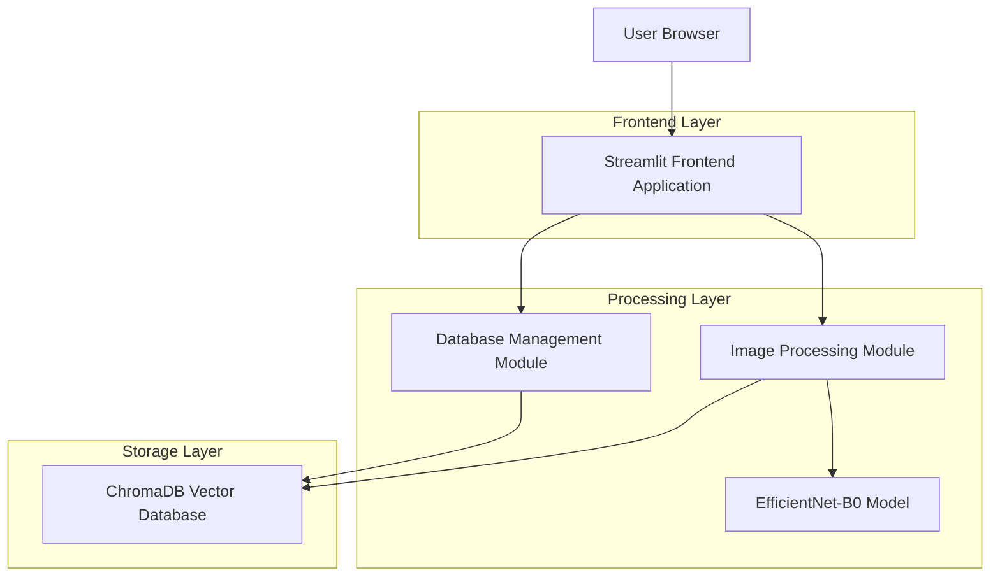
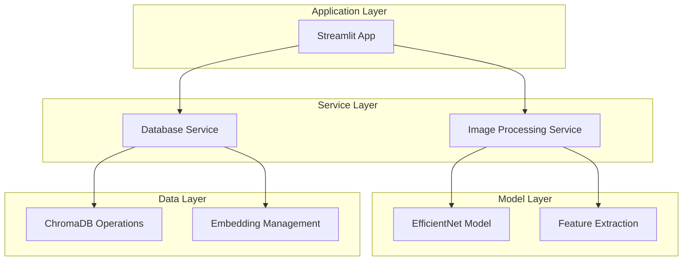
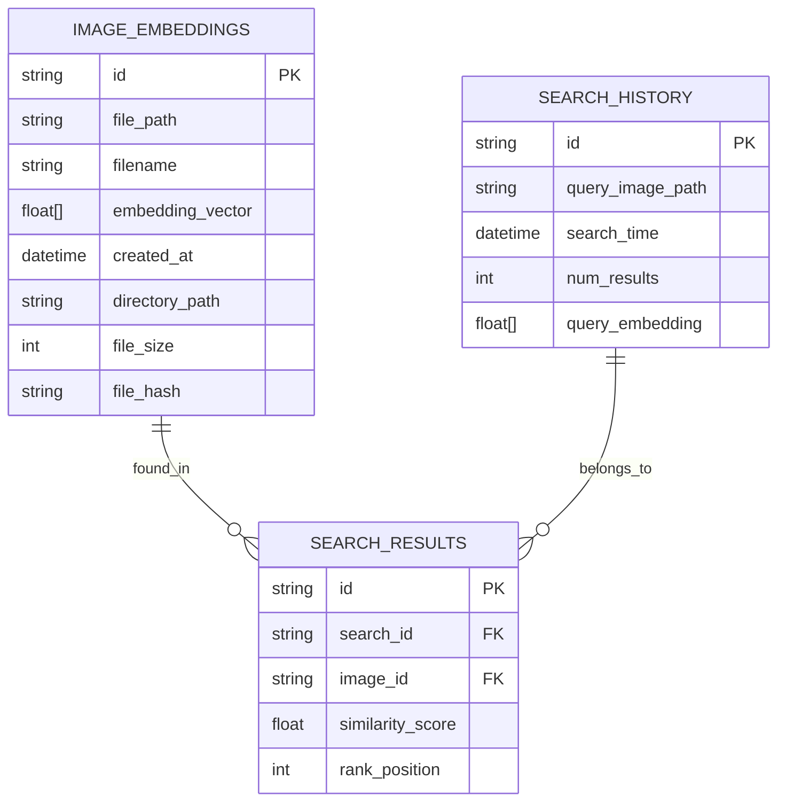

# Reverse Image Search Application - Technical Architecture Document

## 1. Architecture Design



## 2. Technology Description

- **Frontend**: Streamlit@1.28+ + Python@3.8+
- **Deep Learning**: PyTorch@2.0+ + Transformers@4.30+ + EfficientNet-B0
- **Vector Database**: ChromaDB@0.4+
- **Image Processing**: Pillow@10.0+
- **Additional**: NumPy, Pandas for data handling

## 3. Route Definitions

| Route | Purpose |
|-------|---------|
| / | Home page with image upload and search functionality |
| /database | Database management page for creating and managing embeddings |
| /settings | Configuration page for model and search parameters |

## 4. API Definitions

### 4.1 Core API

**Image Processing Functions**

```python
def extract_features(image_path: str) -> np.ndarray
```
Extract feature vectors from images using EfficientNet-B0

Parameters:
| Param Name | Param Type | isRequired | Description |
|------------|------------|------------|-------------|
| image_path | string | true | Path to the image file |

Returns:
| Param Name | Param Type | Description |
|------------|------------|-------------|
| features | np.ndarray | 1280-dimensional feature vector |

**Database Operations**

```python
def create_embeddings(directory_path: str) -> bool
```
Create embeddings for all images in a directory

Parameters:
| Param Name | Param Type | isRequired | Description |
|------------|------------|------------|-------------|
| directory_path | string | true | Path to directory containing images |

Returns:
| Param Name | Param Type | Description |
|------------|------------|-------------|
| success | boolean | Operation success status |

**Search Functions**

```python
def search_similar_images(query_image: str, n_results: int = 5) -> List[Dict]
```
Find similar images in the database

Parameters:
| Param Name | Param Type | isRequired | Description |
|------------|------------|------------|-------------|
| query_image | string | true | Path to query image |
| n_results | integer | false | Number of similar images to return (default: 5) |

Returns:
| Param Name | Param Type | Description |
|------------|------------|-------------|
| results | List[Dict] | List of similar images with paths and similarity scores |

## 5. Server Architecture Diagram



## 6. Data Model

### 6.1 Data Model Definition



### 6.2 Data Definition Language

**ChromaDB Collection Schema**

```python
# Image embeddings collection
collection = client.create_collection(
    name="image_embeddings",
    metadata={"hnsw:space": "cosine"}  # Use cosine similarity
)

# Collection structure
{
    "ids": ["image_001", "image_002", ...],  # Unique identifiers
    "embeddings": [[0.1, 0.2, ...], [0.3, 0.4, ...], ...],  # 1280-dim vectors
    "metadatas": [
        {
            "file_path": "/path/to/image1.jpg",
            "filename": "image1.jpg",
            "directory": "/path/to/directory",
            "file_size": 1024000,
            "created_at": "2024-01-01T00:00:00Z",
            "file_hash": "sha256_hash_value"
        },
        ...
    ]
}

# Search configuration
search_params = {
    "n_results": 10,  # Number of similar images to return
    "include": ["metadatas", "distances"],  # Include metadata and similarity scores
    "where": {"directory": "/specific/path"}  # Optional filtering
}
```

**File System Structure**

```
reverse-image-search/
├── app.py                 # Main Streamlit application
├── requirements.txt       # Python dependencies
├── src/
│   ├── image_processor.py # Image processing and feature extraction
│   ├── database_manager.py # ChromaDB operations
│   ├── search_engine.py   # Search functionality
│   └── utils.py          # Utility functions
├── models/               # Pre-trained model cache
├── data/                # Sample images and test data
└── .streamlit/          # Streamlit configuration
    └── config.toml
```